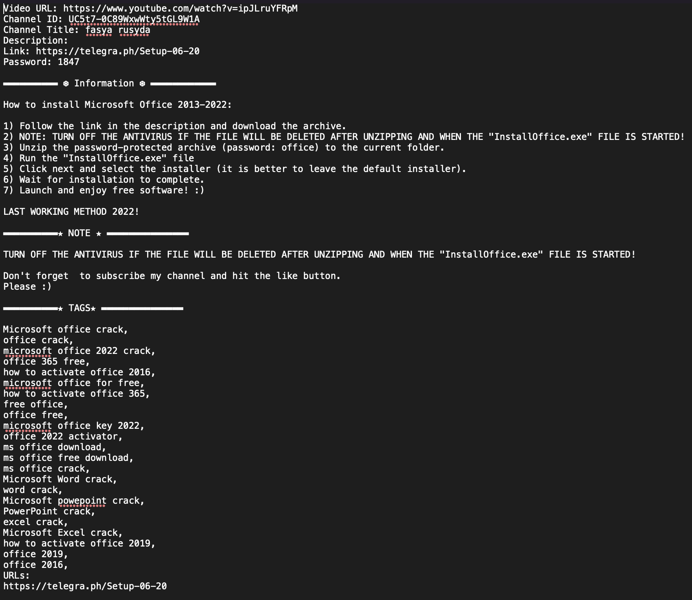
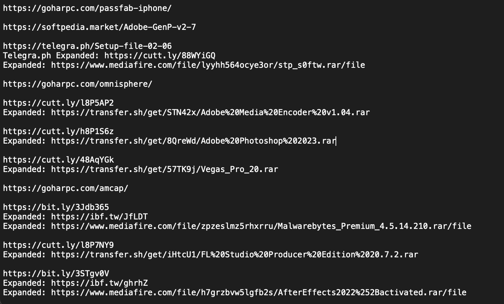

# YouTube Link Parser
Script to query YouTube API and parse out potentially malicious links

## Notes
- By default, the script queries for the keywords `cracked software`
- I created a custom version of [urlexpander](https://github.com/SMAPPNYU/urlExpander), called urlexpander_custom, to add the capability to expand `idf.tw` shortlinks.
- Will need to create a YouTube API key. Follow instructions here: https://developers.google.com/youtube/v3/getting-started


## Setup

```
python3 -m venv env
source env/bin/activate
pip3 install --upgrade pip
pip3 install -r requirements.txt
```

## Run

```bash
./query_youtube_api.py
```

## Output

Script will output two files:
  - yt_api_verbose.txt
    - A text file containing video URL, channel ID, channel title, video description (these usually contain an archive password), and any associated URLs extracted.
  - expanded_links.txt
    - A text file containing all links, with shortened URL expansion performed. Also includes functionality to parse all links from telegra.ph sites.
  



